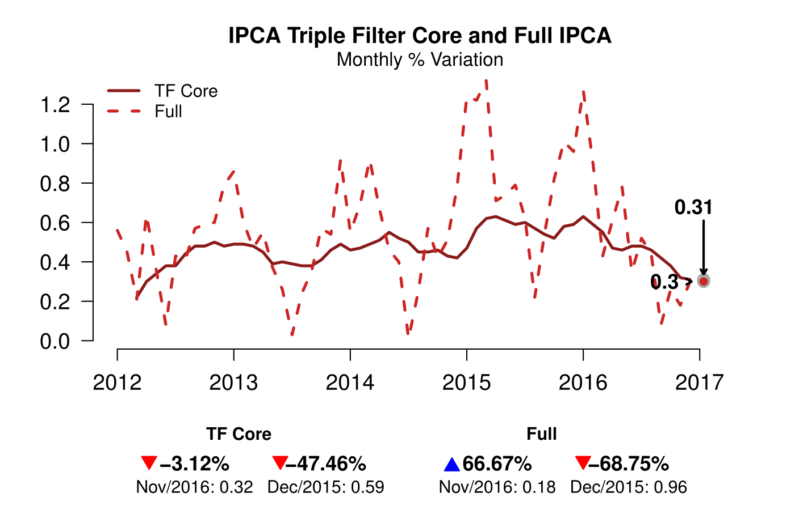
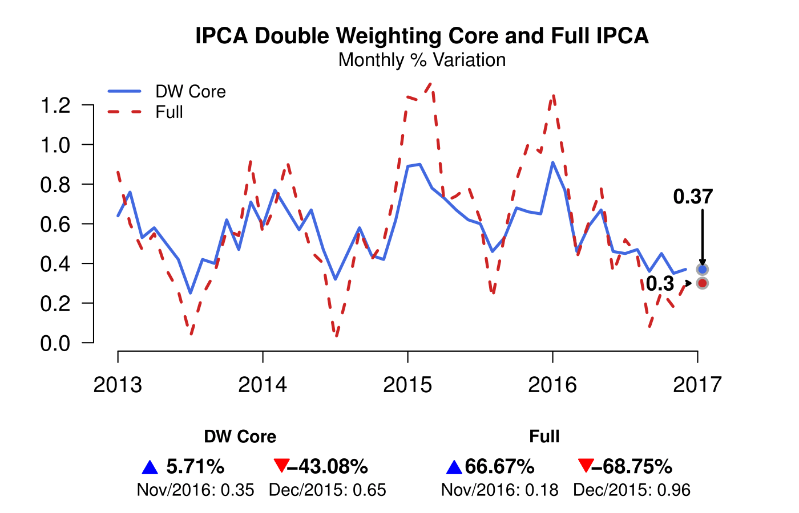
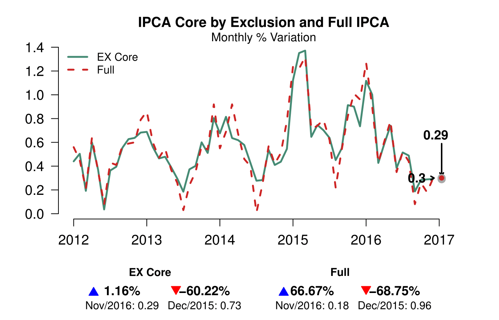
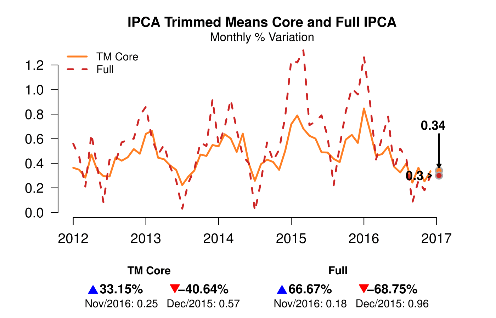
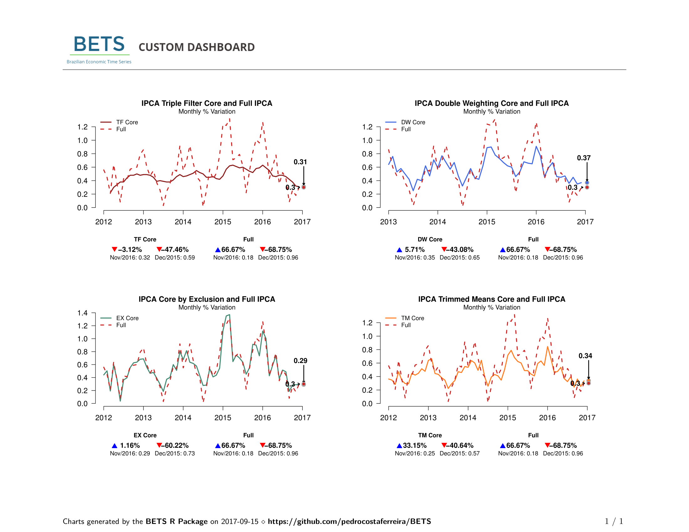

```{r setup, echo = FALSE}
knitr::opts_chunk$set(warning=FALSE, message=FALSE)
```

Firstly, we load the Inflation and the BETS package:

```{r}
library(BETS)
library(Inflation)
```


Now, lets suppose we are in Brazil and we want to capture the core inflation of the IPCA - Consumer Price Index (measured by the IBGE - Brazilian Institute of geography and statistics).

We begin finding the ipca series using the BETS package, we want the monthly variation.

```{r}
BETS.search("ipca ~ -", unit = "Monthly % var.", view = F)
```

We limit our time series window from the beginning of 2012 to the end of 2016.

```{r}
ipca <- window(BETS.get(433), start = c(2012,1), end = c(2016,12)) 
```

We also use our function *ipca_get* to be able to access the IPCA components.

```{r}
ipca_sub <- ipca_get(group = "subitem")
```

## Triple Filter

The code below produces the triple filter core inflation as in [Ferreira et al. (2016)] (https://goo.gl/UYLhcj). This measurement is plotted against the full IPCA to enable comparisons (dotted red line) and, as expected, presents less variation through the time window we selected.

The triple filter core inflation performs three operations as its name suggests: trimmed means, seasonal adjustment and moving averages. Results show that the triple filter provides better results than when its components are run alone and that it brings more information than the 12 month accumulated inflation.

```{r eval = F}
charts.opts <- list()

core.tf <- INFL.core_tf(subits.var=ipca_sub$ipca_ts, weights = ipca_sub$weights_ts)
core.tf <- window(round(core.tf,2), start = c(2012,3), end = c(2016,12))

charts.opts[[1]] <- list(
    type = "lines",
    title = "IPCA Triple Filter Core and Full IPCA",
    subtitle = "Monthly % Variation",
    legend = c("TF Core", "Full"),
    xlim = c(2012,2017.2),
    arr.len = 0.3, 
    extra = ipca
)

BETS.chart(ts = core.tf, style = "normal", file = "core_tf", open = T, params = charts.opts[[1]])
```

{ width=450 }


## Other Filters

The package is able to compute other core functions, these are well known and established methods and we provide below the code and visualization of how they perform against the full inflation:

### Double Weighing Core

The double weighing filter gives each component a new weighing based on the inversion of its volatility. The filter uses the weights of each component and recomputes it based on its volatility where the more volatility an item has, the less weight it will carry on the core inflation.


```{r eval = F}
core.dw <- INFL.core_dw(infl.var = ipca_sub$ipca_index,
                        subits.var = ipca_sub$ipca_ts,
                        weights = ipca_sub$weights_ts,
                        wind = 12)

core.dw <- window(round(core.dw,2), end = c(2016,12))

charts.opts[[2]] <- list(
    type = "lines",
    title = "IPCA Double Weighting Core and Full IPCA",
    subtitle = "Monthly % Variation",
    colors = c("royalblue", "firebrick3"),
    legend = c("DW Core", "Full"),
    xlim = c(2013,2017.2),
    arr.len = 0.3, 
    extra = window(ipca,start = c(2013,1))
)

BETS.chart(ts = core.dw, style = "normal", file = "core_dw", open = T, params = charts.opts[[2]])
```

{ width=450 }


### Exclusion Core

This function *INFL.core_ex* computes one of the more established methods to determine core inflation, the exclusion method based on removing food related topics and energy from the calculations

```{r eval = F}
core.ex <- INFL.core_ex(subits.var = ipca_sub$ipca_ts,
                        weights = ipca_sub$weights_ts,
                        info = ipca_sub$cod,
                        n.blocks = 4,
                        alpha = 2)

core.ex <- window(core.ex, end = c(2016,12))

charts.opts[[3]] <- list(
    type = "lines",
    title = "IPCA Core by Exclusion and Full IPCA",
    subtitle = "Monthly % Variation",
    colors = c("aquamarine4", "firebrick3"),
    legend = c("EX Core", "Full"),
    xlim = c(2012,2017.2),
    arr.len = 0.3, 
    extra = ipca
)

BETS.chart(ts = core.ex, style = "normal", file = "core_ex", open = T, params = charts.opts[[3]])
```

{ width=450 }

### Trimmed Means Core

The trimmed means core returns 60% of the total data, removing the bottom and the upper 20% items that present the biggest volatility. This core comes from the concept of estimators with limited influence and another example would be using the median to have a similar effect.

```{r eval = F}
core.tm <- INFL.core_tm(subits.var = ipca_sub$ipca_ts, weights = ipca_sub$weights_ts)$core
core.tm <- window(core.tm, end = c(2016,12))

charts.opts[[4]] <- list(
    type = "lines",
    title = "IPCA Trimmed Means Core and Full IPCA",
    subtitle = "Monthly % Variation",
    colors = c("chocolate1", "firebrick3"),
    legend = c("TM Core", "Full"),
    xlim = c(2012,2017.2),
    arr.len = 0.3, 
    extra = ipca
)

BETS.chart(ts = core.tm, style = "normal", file = "core_tm", open = T, params = charts.opts[[4]])
```

{ width=450 }


## Dashboard

We provide a dashboard to help the comparison between the four options.


```{r eval = F}
parameters <- list(
    style = "normal", 
    charts.opts = charts.opts)

cores <- list(core.tf, core.dw, core.ex, core.tm)

BETS.dashboard(type = "custom", charts = cores, saveas = "custom_dashboard.pdf", parameters = parameters)
```

{ width=650 }


