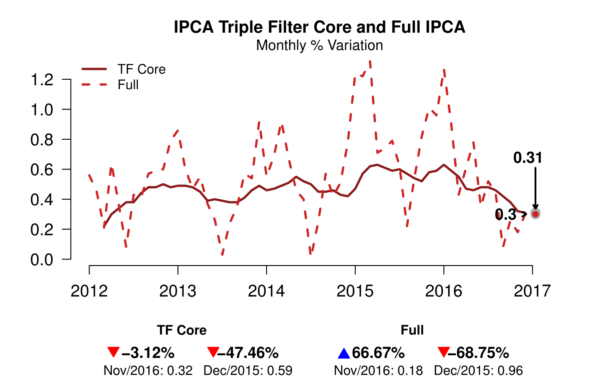
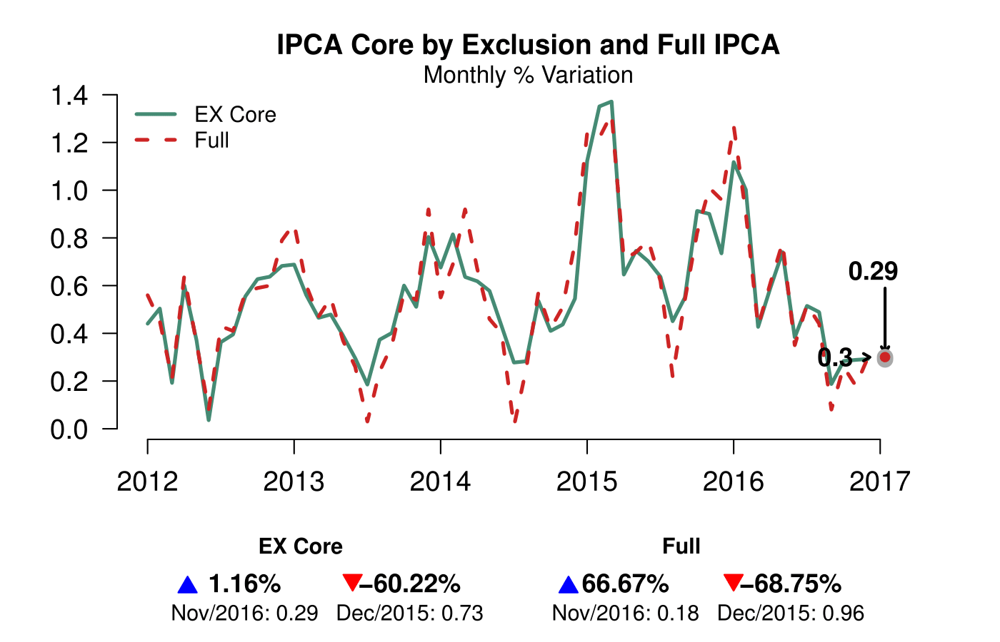
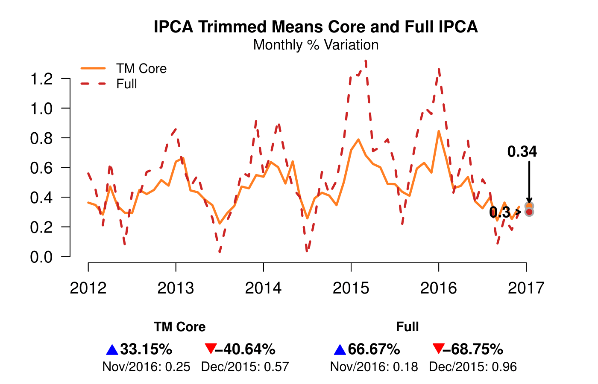

```{r setup, echo = FALSE}
knitr::opts_chunk$set(warning=FALSE, message=FALSE)
```

```{r}
library(BETS)
library(Inflation)
```


```{r}
BETS.search("ipca ~ -", unit = "Monthly % var.", view = F)
```

```{r}
ipca <- window(BETS.get(433), start = c(2012,1), end = c(2016,12)) 
```

```{r eval = F}
charts.opts <- list()

core.tf <- INFL.core_tf(subits.var=ipca_sub$ipca_ts, weights = ipca_sub$weights_ts)
core.tf <- window(round(core.tf,2), start = c(2012,3), end = c(2016,12))

charts.opts[[1]] <- list(
    type = "lines",
    title = "IPCA Triple Filter Core and Full IPCA",
    subtitle = "Monthly % Variation",
    legend = c("TF Core", "Full"),
    xlim = c(2012,2017.2),
    arr.len = 0.3, 
    extra = ipca
)

BETS.chart(ts = core.tf, style = "normal", file = "core_tf", open = T, params = charts.opts[[1]])
```

{ width=450 }

```{r eval = F}
core.dw <- INFL.core_dw(infl.var = ipca_sub$ipca_index,
                        subits.var = ipca_sub$ipca_ts,
                        weights = ipca_sub$weights_ts,
                        wind = 12)

core.dw <- window(round(core.dw,2), end = c(2016,12))

charts.opts[[2]] <- list(
    type = "lines",
    title = "IPCA Double Weighting Core and Full IPCA",
    subtitle = "Monthly % Variation",
    colors = c("royalblue", "firebrick3"),
    legend = c("DW Core", "Full"),
    xlim = c(2013,2017.2),
    arr.len = 0.3, 
    extra = window(ipca,start = c(2013,1))
)

BETS.chart(ts = core.dw, style = "normal", file = "core_dw", open = T, params = charts.opts[[2]])
```

{ width=450 }

```{r eval = F}
core.ex <- INFL.core_ex(subits.var = ipca_sub$ipca_ts,
                        weights = ipca_sub$weights_ts,
                        info = ipca_sub$cod,
                        n.blocks = 4,
                        alpha = 2)

core.ex <- window(core.ex, end = c(2016,12))

charts.opts[[3]] <- list(
    type = "lines",
    title = "IPCA Core by Exclusion and Full IPCA",
    subtitle = "Monthly % Variation",
    colors = c("aquamarine4", "firebrick3"),
    legend = c("EX Core", "Full"),
    xlim = c(2012,2017.2),
    arr.len = 0.3, 
    extra = ipca
)

BETS.chart(ts = core.ex, style = "normal", file = "core_ex", open = T, params = charts.opts[[3]])
```

{ width=450 }

```{r eval = F}
core.tm <- INFL.core_tm(subits.var = ipca_sub$ipca_ts, weights = ipca_sub$weights_ts)$core
core.tm <- window(core.tm, end = c(2016,12))

charts.opts[[4]] <- list(
    type = "lines",
    title = "IPCA Trimmed Means Core and Full IPCA",
    subtitle = "Monthly % Variation",
    colors = c("chocolate1", "firebrick3"),
    legend = c("TM Core", "Full"),
    xlim = c(2012,2017.2),
    arr.len = 0.3, 
    extra = ipca
)

BETS.chart(ts = core.tm, style = "normal", file = "core_tm", open = T, params = charts.opts[[4]])
```

{ width=450 }

```{r eval = F}
parameters <- list(
    style = "normal", 
    charts.opts = charts.opts)

cores <- list(core.tf, core.dw, core.ex, core.tm)

BETS.dashboard(type = "custom", charts = cores, saveas = "custom_dashboard.pdf", parameters = parameters)
```

{ width=650 }


